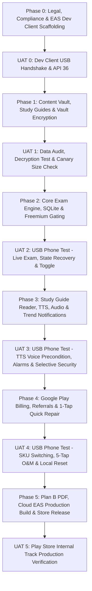

# EasyCTET Master Implementation Plan (Phased with UAT Gates)

**Document Version:** 2.0  
**Target Platform:** Android 16 (API 36 - Google Play Mandate) & backward-compatible to Android 7.0 (API 24)  
**Developer Profile:** Solo Developer, Low-Spec Laptop (<250 MB RAM development overhead)  
**Compilation Strategy:** 100% Expo Application Services (EAS) Cloud Build  
**Testing Workflow:** Physical Android 15 Device connected via USB (`adb reverse`) running custom EAS Development Client  
**Architecture Reference:** [easyctet_app_ssd_v2.md](file:///c:/Users/Admin/Summs/EasyCTET/docs/easyctet_app_ssd_v2.md) (v3.0)  
**Design Reference:** [easyctet_brand_bible.md](file:///c:/Users/Admin/Summs/EasyCTET/docs/easyctet_brand_bible.md) (v3.0)

---

## Executive Summary & Hardware Strategy

EasyCTET is an ultra-lean, 100% offline, True Zero-Telemetry mobile exam simulation and revision platform for CTET aspirants.

### 1. The Low-Spec Solo-Developer Workflow (EAS Dev Client + USB)
* **Local Machine Constraints:** The developer machine has limited RAM/CPU. Local Android Studio and local Android Virtual Device (AVD) emulators are strictly prohibited.
* **Why Expo Go Cannot Be Used:** The app relies on custom native JSI modules (`react-native-mmkv` for ultra-fast session persistence, `react-native-iap` for Play Billing, `@notifee/react-native` for background WorkManager alarms, and native `FLAG_SECURE` screen protection). Expo Go does not contain these native binaries.
* **The Development Build Solution:**
  1. In **Phase 0**, we compile a custom **EAS Development Client APK** (`eas build --profile development --platform android`) **once in the Expo Cloud**. The local laptop executes zero compilation.
  2. The resulting `.apk` is installed onto the physical Android 15 test phone via USB.
  3. All daily coding uses `npx expo start` over USB (`adb reverse tcp:8081 tcp:8081`). The developer gets instant Fast Refresh (<250 MB RAM load) on the real phone with 100% of native modules active.
  4. The dev client is only rebuilt if a new native library is added to `package.json`.

### 2. The Golden Simplification: Dropping Google Sign-In
* **Why Google Sign-In was Eliminated:** Google Play In-App Billing already natively recognizes and restores purchases across all of a user's devices linked to that Google account.
* **Radical Advantages:**
  * **Zero Onboarding Friction:** Candidates open the app and instantly start practicing without an account creation barrier.
  * **100% "No data collected" Compliance:** Zero collection of candidate emails, names, or Google UIDs. No user databases, no cloud authentication tokens.
  * **Exempt from Mandatory Account Deletion:** Google Play's mandatory account deletion policy applies only to apps requiring user accounts. By operating account-free, EasyCTET avoids complex web and in-app account deletion portals.
  * **Privacy Control:** Replaced with an in-app **"Reset All Local Data & Clear Progress"** button (`Settings > Data & Privacy > Reset Local Progress`).

### 3. Starter Content Scope (English First, Bilingual-Ready)
* **Launch Subject:** Paper 1 Child Development & Pedagogy (CDP) – 30 Questions in English (`CDP-P1-001` to `CDP-P1-030`).
* **Schema:** Standardized to Section 3.2 with bilingual-ready keys (`question_en`, `options_en`, `explanation_en`, `question_hi: null`).
* **UI Toggle:** The test screen includes the `[ EN | HI ]` toggle; tapping `HI` displays a clean notice (*"Hindi content arriving in upcoming update"*), and verifies session state preservation. Full Hindi translations will be incorporated in the next content iteration.

---

## Master Architecture & Directory Structure

Mobile code is isolated cleanly in `/mobile` to prevent any dependency conflict with legacy web files.

```
EasyCTET/
├── docs/                               # Master Architectural & Legal Documents
│   ├── easyctet_app_ssd_v2.md          # System Architecture Specification v3.0
│   ├── easyctet_brand_bible.md         # Brand Design Tokens & Voice v3.0
│   ├── MASTER_IMPLEMENTATION_PLAN.md   # This Master Implementation Plan v2.0
│   └── legal/
│       ├── PRIVACY_POLICY.md           # DPDP Act 2023, Zero-Telemetry, Grievance Officer
│       ├── TERMS_OF_SERVICE.md         # Freemium terms, Google Play refund terms
│       └── GOVERNMENT_DISCLAIMER.md    # Mandatory Non-Affiliation Disclaimer
├── mobile/                             # Standalone Expo Mobile App (Target SDK 36)
│   ├── assets/
│   │   ├── fonts/                      # SubsetFonts (Outfit, Inter, Noto Sans Devanagari)
│   │   ├── guides/                     # Markdown Study Guides (Piaget, Vygotsky)
│   │   └── data/                       # Encrypted Question Vault & Trend Matrix
│   ├── src/
│   │   ├── components/                 # Atomic UI Components (Badges, Buttons, Modals)
│   │   ├── screens/                    # ExamScreen, StudyScreen, ScorecardScreen, Settings
│   │   ├── engine/                     # Scoring, Timer, SQLite Mistake Ledger, MMKV
│   │   ├── audio/                      # Native TTS Engine & MP3 Masterclass Player
│   │   ├── billing/                    # Google Play In-App Billing (Standard vs Referred SKU)
│   │   ├── notifications/              # Local Trend Radar Offline Scheduler (WorkManager)
│   │   └── theme/                      # Brand Bible Color Tokens & Typographic Badges
│   ├── app.json                        # Expo Config (targetSdkVersion: 36, minSdkVersion: 24)
│   ├── eas.json                        # EAS Profiles: 'development' (dev-client) & 'production' (<15MB .aab)
│   └── package.json
└── scripts/                            # Desktop Validation & Build Tools
    ├── audit-question-vault.js         # Schema, ID uniqueness, & Key Integrity Validator
    ├── encrypt-vault.js                # AES-256 Question Encryption Tool
    └── generate-plan-b-pdf.js          # Plan B Master Study Pack PDF Generator
```

---

## Phased Implementation Roadmap with UAT Gates

Work proceeds strictly through sequential phases. **No phase commences until the prior phase's physical UAT checklist is tested on the Android 15 USB device and signed off.**



---

## Phase 0: Legal, Compliance & EAS Dev Client Scaffolding

### Goals & Deliverables
1. **Legal Documents (`docs/legal/`):**
   * `PRIVACY_POLICY.md`: Zero-Telemetry certified, DPDP Act 2023 compliant, Google Play Data Safety "No data collected", and explicit **Grievance Officer contact details** (per IT Rules 2021).
   * `TERMS_OF_SERVICE.md`: Freemium entitlement (Test 1 free forever), 1-click Google Play refund terms.
   * `GOVERNMENT_DISCLAIMER.md`: Prominent non-affiliation disclaimer stating EasyCTET is an independent private preparation platform.
2. **Project Scaffolding (`/mobile`):**
   * Initialize Expo app with TypeScript, Hermes engine, and React Native 0.76+.
   * Configure `app.json`: `targetSdkVersion: 36`, `compileSdkVersion: 36`, `minSdkVersion: 24`, and Android 15 Edge-to-Edge safe area insets (`react-native-safe-area-context`).
   * Configure `eas.json` with a `development` build profile.
3. **EAS Cloud Development Build:**
   * Run `eas build --profile development --platform android` once in the cloud to generate the custom EasyCTET Development APK (including `react-native-mmkv`, `react-native-iap`, `@notifee/react-native`, and `FLAG_SECURE`).
   * Install the dev client APK on the physical phone via USB.

### 🧪 UAT Checkpoint 0: Dev Client USB Handshake & Policy Review
* **Device:** Android 15 Physical Phone connected via USB.
* **Verification Steps:**
  1. [ ] **Google Play API 36 Check:** Confirm `app.json` specifies `targetSdkVersion: 36` to satisfy Google Play's active new-app submission mandate.
  2. [ ] **Dev Client Installation:** Install the cloud-compiled development APK onto the Android 15 phone via `adb install`.
  3. [ ] **USB Fast Refresh Test:** Run `npx expo start` in `/mobile` with `adb reverse tcp:8081 tcp:8081`; open the dev client on phone and confirm live handshake.
  4. [ ] **Edge-to-Edge Check:** Confirm blank starter screen renders without UI clipping from status bar or Android 15 navigation gesture bar.
  5. [ ] **Legal Review:** Verify `PRIVACY_POLICY.md` contains Grievance Officer contact details and zero-telemetry declarations.
* **Sign-off Criteria:** Custom Dev Client loads on Android 15 phone over USB with Fast Refresh working.

---

## Phase 1: Content Vault, Study Guides & Vault Encryption

### Goals & Deliverables
1. **Author English CDP Starter Dataset (`mobile/assets/data/cdp_30.json`):**
   * Standardize the first 30 questions (`CDP-P1-001` to `CDP-P1-030`) from `engines/P1/CDP/cdp_questions.json`.
   * Standardize to Section 3.2 schema with cognitive domain, empirical trend tags, options (A/B/C/D), and detailed pedagogical explanations.
   * Maintain bilingual-ready keys (`question_hi: null`, `options_hi: null`).
2. **Author Free Study Guides (`mobile/assets/guides/`):**
   * `piaget_cognitive_development.md`: Sensorimotor, Pre-operational, Concrete & Formal stages with exam traps.
   * `vygotsky_scaffolding.md`: Zone of Proximal Development (ZPD), MKO, and Scaffolding pedagogy.
3. **Author Empirical Trend Matrix (`mobile/assets/data/exam_trends.json`):**
   * Empirical recurrence mappings for high-yield topics (Piaget, Vygotsky, Kohlberg, Inclusive Education).
4. **Author CLI Tools (`scripts/`):**
   * `audit-question-vault.js`: Validates 100% ID uniqueness, correct option mapping, and non-empty explanations.
   * `encrypt-vault.js`: Encrypts `cdp_30.json` using AES-256-CBC into `assets/data/vault.bin`.
5. **Phase 1 Asset Size Canary Check:**
   * Calculate total size of subset fonts + encrypted vault + study guides. Verify it tracks well under 5 MB (safeguarding the <15 MB final `.aab` budget).

### 🧪 UAT Checkpoint 1: Data Audit, Encryption & Canary Check
* **Device:** Desktop terminal + Mobile asset inspector.
* **Verification Steps:**
  1. [ ] Run `node scripts/audit-question-vault.js`: verify 30/30 questions pass schema validation with zero errors.
  2. [ ] Run `node scripts/encrypt-vault.js`: verify `vault.bin` is generated and decryptable via test harness.
  3. [ ] Review `piaget_cognitive_development.md` and `vygotsky_scaffolding.md` for formatting and pedagogical accuracy.
  4. [ ] **Canary Budget Check:** Verify total Phase 1 assets are under 5 MB.
* **Sign-off Criteria:** 100% audit pass, clean encryption, assets well within size budget.

---

## Phase 2: Core Exam Engine, SQLite & Freemium Gating

### Goals & Deliverables
1. **Design System & Typography (`mobile/src/theme/`):**
   * Color tokens: Heritage Navy (`#1E293B`), Turmeric Gold Deep (`#B45309`), Amber Dawn (`#F59E0B`), Sage Green Deep (`#047857`), Terracotta Red (`#DC2626`), Warm Ivory (`#F8FAFC`), Midnight Slate (`#0F172A`).
   * Typography: **Outfit** (Display/Headings), **Inter** (Body/Options), **Noto Sans Devanagari** (Hindi subset).
   * Dignified Typographic Badges: `[ DISTINCTION ]`, `[ EXAM READY ]`, `[ REVISE ]`.
2. **In-Memory Vault Decryptor (`mobile/src/engine/VaultDecryptor.ts`):**
   * Decrypts `vault.bin` directly in RAM; never writes decrypted questions to unencrypted disk storage.
3. **Hermetic Test Simulation Engine (`mobile/src/engine/`):**
   * Countdown exam timer with pause and auto-submit.
   * Question palette (Answered, Unanswered, Marked for Review).
   * **Bilingual Toggle Behavior:** Displays `[ EN | HI ]`. Tapping `HI` displays an informative tooltip (*"Hindi content releasing in upcoming update"*). Toggling preserves current selection, active question index, and elapsed time without re-rendering.
4. **Freemium Gating Logic:**
   * Paper 1 CDP Test 1 is unlocked for free practice.
   * Subsequent test sets display a lock badge and prompt the Google Play billing drawer.
5. **Local SQLite Mistake Ledger & MMKV Persistence:**
   * SQLite records candidate mistake ledger (question ID, chosen option, correct option, timestamp).
   * Fast MMKV stores active in-flight test progress for instantaneous recovery.

### 🧪 UAT Checkpoint 2: Hands-on Phone Test (Exam Engine & State Recovery)
* **Device:** Android 15 Physical Phone via USB.
* **Verification Steps:**
  1. [ ] Start free CDP practice test on phone: verify timer counts down smoothly.
  2. [ ] Answer 5 questions, mark 1 for review; tap `[ EN | HI ]` toggle: verify tooltip appears and no selected answer or timer state is lost.
  3. [ ] **Process Kill Test:** Force close the app via Android 15 app switcher while test is running. Re-launch app: verify it immediately resumes at the exact question with answers and timer intact.
  4. [ ] Submit test: verify automatic score calculation (e.g., 24/30), display of typographic badge (`[ DISTINCTION ]`), and review of explanations.
  5. [ ] Tap locked paper in dashboard: verify freemium gate intercepts and displays the unlock drawer.
* **Sign-off Criteria:** Flawless test execution, instant state recovery, and proper freemium gating on Android 15 phone.

---

## Phase 3: Study Guide Reader, TTS, Audio & Trend Notifications

### Goals & Deliverables
1. **Markdown Study Guide Reader (`mobile/src/screens/StudyGuideScreen`):**
   * Clean typography on Warm Ivory (`#F8FAFC`) with Midnight Slate Dark Mode toggle.
   * Renders `piaget_cognitive_development.md` and `vygotsky_scaffolding.md` with pedagogical callout boxes.
2. **On-Device Native TTS Companion (`mobile/src/audio/TTSEngine.ts`):**
   * Uses Android native Text-To-Speech engine (`en-IN`).
   * Sentence-by-sentence highlight tracking and chunk-based resume.
   * Deterministic Error ID `L2-TTS-001` if offline voice pack is missing.
3. **Offline MP3 Masterclass Player (`mobile/src/audio/AudioPlayer.ts`):**
   * Local playback of bundled/downloaded MP3 masterclasses with 1.0x, 1.25x, 1.5x speed controls.
4. **Empirical Trend Radar Notification Engine (`mobile/src/notifications/TrendRadar.ts`):**
   * 100% offline local notification alarms scheduled via Android WorkManager (`@notifee/react-native`).
   * Triggers daily at 9:00 AM (Morning Concept Boost) and 6:00 PM (Evening Trend Focus) pulling from `exam_trends.json`.
5. **Selective `FLAG_SECURE`:**
   * Enforced on active timed exam screens (blocks screenshot/screen recording).
   * Lifted on Scorecard and Explanation screens to allow screenshot sharing on WhatsApp.

### 🧪 UAT Checkpoint 3: Hands-on Phone Test (TTS, Alarms & Security)
* **Device:** Android 15 Physical Phone via USB.
* **Verification Steps:**
  1. [ ] **TTS Precondition Check:** Verify `en-IN` offline voice data is installed under Android `Settings > Accessibility > Text-to-speech output`.
  2. [ ] Open Piaget Study Guide; tap "Listen to Guide": verify native TTS reads aloud clearly offline.
  3. [ ] Test dark mode toggle: verify crisp contrast adhering to Brand Bible tokens.
  4. [ ] **Trend Radar Test:** Trigger test notification from Trend Radar: verify prompt displays empirical trend focus without marketing clickbait.
  5. [ ] **Security Test (Exam Screen):** Attempt screenshot on live exam screen: verify Android 15 blocks capture (*"Can't take screenshot due to security policy"*).
  6. [ ] **Security Test (Scorecard):** Finish exam and take screenshot on Scorecard: verify screenshot captures cleanly for WhatsApp sharing.
* **Sign-off Criteria:** Native TTS reads offline, local notifications fire on schedule, and selective screen security behaves accurately.

---

## Phase 4: Google Play Billing, Referrals & 1-Tap Quick Repair

### Goals & Deliverables
1. **Google Play In-App Billing (`mobile/src/billing/PlayBilling.ts`):**
   * Standard SKUs: `paper1_standard` (₹999), `combo_standard` (₹1,799).
   * Referred SKUs: `paper1_referred` (₹749), `combo_referred` (₹1,499).
   * Account-level entitlement verification: restores purchases seamlessly across devices via `queryPurchasesAsync`.
2. **Referral Attribution & Promo Codes:**
   * Reads Google Play Install Referrer API for organic attribution (`SHORTS25`, `WEB25`, `ANITA25`).
   * Fallback promo code input field in payment drawer: entering valid code switches the SKU request from `standard` to `referred_25`, causing the Google Play bottom sheet to reflect the discounted ₹749 price.
3. **Solo-Developer Support & Self-Healing:**
   * **Plan A Quick Repair:** 1-Tap button in `Settings > Help` flushes cache and re-indexes SQLite ledger in <1s.
   * **Deterministic Error IDs:** Standardized codes (`L1-DATA-002`, `L2-TTS-001`, `L3-BILL-001`).
   * **1-Tap Diagnostic Share:** Generates a pre-filled email draft with Error ID, device model, and Android OS version (Zero-Telemetry compliant).
   * **Hidden O&M Dashboard:** Tapping App Version **5 times** in `Settings > About` unlocks on-device diagnostics (vault integrity test, database status, memory footprint).
4. **In-App Local Data Reset (`Settings > Data & Privacy > Reset Local Progress`):**
   * Two-step confirmation dialog allowing candidate to wipe all local test history, mistake logs, and MMKV state.

### 🧪 UAT Checkpoint 4: Hands-on Phone Test (Billing & O&M)
* **Device:** Android 15 Physical Phone via USB.
* **Verification Steps:**
  1. [ ] Open unlock drawer; enter promo code `SHORTS25`: verify UI switches to `referred_25` SKU and Google Play purchase sheet shows ₹749.
  2. [ ] Complete test purchase using Google Play Console License Testing account: verify locked papers unlock immediately.
  3. [ ] Tap "Quick Repair" in Settings: verify instant visual confirmation of cache flush and SQLite re-indexing.
  4. [ ] Tap app version **5 times**: verify hidden O&M dashboard unlocks and reports 100% vault integrity.
  5. [ ] Tap "Reset Local Progress": verify local test scores are wiped and app returns to pristine state.
* **Sign-off Criteria:** Sandbox billing succeeds, referral code switches SKU, 5-tap O&M functions, local data reset succeeds.

---

## Phase 4.5: CDP Full Curriculum Ingestion & Candidate Review Gate

### Goals & Deliverables
1. **Full 150 CDP Question Vault (`mobile/assets/data/cdp_full_150.json`):**
   - Normalize all 150 CDP questions from `engines/P1/CDP/cdp_questions.json`.
   - Organize into 5 complete 30-question simulated exam sets:
     - `CDP-P1-SET1` (Q01–Q30): Cognitive Theorists & Development (Free Tier Diagnostic)
     - `CDP-P1-SET2` (Q31–Q60): Socio-Cultural & Moral Development
     - `CDP-P1-SET3` (Q61–Q90): Inclusive Education & Learning Disabilities
     - `CDP-P1-SET4` (Q91–Q120): Progressive Pedagogy & Assessment (CCE)
     - `CDP-P1-SET5` (Q121–Q150): Child Psychology, Motivation & Thinking
   - Normalize schema to `mobile/src/engine/types.ts` (`options_en: { A, B, C, D }`, `correct_option: 'A'|'B'|'C'|'D'`, `explanation_en`, `topicTag`, `subtopic`, `difficulty`).
2. **Comprehensive 11-Topic CDP Study Guide Hub (`mobile/src/data/cdpStudyGuides.ts`):**
   - Ingest all 11 core theoretical study guides from `Study-guides/CDP/`:
     - 01: Jean Piaget (Stages, Schemas, Assimilation/Accommodation)
     - 02: Lev Vygotsky (ZPD, Scaffolding, Private Speech)
     - 03: Lawrence Kohlberg & Carol Gilligan (Moral Development)
     - 04: Physical & Directional Development (Cephalocaudal & Proximodistal)
     - 05: Motor Skills Timeline (Gross & Fine Motor Control)
     - 06: Howard Gardner (Multiple Intelligences Theory)
     - 07: Constructivism & Progressive Pedagogy (Child-Centered Education)
     - 08: Assessment & Evaluation (Formative, Summative & CCE)
     - 09: Motivation & Attribution (Internal/External Locus)
     - 10: Inclusive Education, SLD & Giftedness (Dyslexia, Dysgraphia, ADHD)
     - 11: Socialization, Gender & Culture
   - Dual-theme reader (Warm Ivory `#F8FAFC` & Midnight Slate `#0F172A`) with on-device native TTS audio companion.
3. **Dynamic Multi-Set Dashboard & Exam Engine:**
   - Extend `VaultDecryptor` to load any of the 5 CDP sets dynamically.
   - Update Dashboard to display all 5 CDP sets with individual attempt tracking, time remaining, and distinction badges.
   - Study Guide Screen with topic selector pill carousel for switching between all 11 modules.

### 🧪 UAT Checkpoint 4.5: Candidate Real-World Testing & Content Review
* **Target Examiner:** CTET Paper 1 Aspirant (Exam date: October 6, 2026).
* **Device:** Android 15 Physical Phone (`RZCR90874LD`).
* **Verification Steps:**
  1. [ ] Verify all 5 CDP exam sets launch cleanly with authentic 30-minute timers and 30 questions each.
  2. [ ] Practice sets on device: verify questions, options (A, B, C, D), and pedagogical explanations.
  3. [ ] Explore Study Guide Hub: verify all 11 topics render cleanly in Warm Ivory and Dark Mode.
  4. [ ] Listen to study guides via Native TTS: verify speech pronunciation and pause pacing.
  5. [ ] Collect direct domain and UI/UX feedback ahead of remaining subject additions and cloud release.
* **Sign-off Criteria:** Candidate confirms content accuracy and UI/UX readiness on physical device.

---

## Phase 5: Plan B PDF, Cloud EAS Production Build & Store Release

### Goals & Deliverables
1. **Plan B Study Pack PDF Generator (`scripts/generate-plan-b-pdf.js`):**
   * Node script compiling the 30 CDP questions + study guides into a branded printable PDF for customer support guarantee fulfillment.
2. **Static Promo Website (`easyctet.com`):**
   * Lightweight static site deployed to Cloudflare Pages with Free Masterclass MP3 download and `WEB25` promo CTA.
3. **Expo EAS Cloud Production Build:**
   * Configure `eas.json` with production profile targeting Android App Bundle (`.aab`) with R8 minification and Hermes bytecode.
   * Execute `eas build --profile production --platform android` in Expo Cloud (zero laptop load).
   * Verify final `.aab` is strictly under 15 MB.
4. **Google Play Console Release:**
   * Upload `.aab` to Google Play **Internal Testing Track**.
   * Fill out Google Play Data Safety form: Select **"No data collected"**.
   * Complete Government Impersonation Disclaimer and Grievance Officer details.

### 🧪 UAT Checkpoint 5: Production Internal Track Release Sign-off
* **Device:** Android 15 Physical Phone (via Google Play Store link).
* **Verification Steps:**
  1. [ ] Receive Google Play Internal Testing link; install EasyCTET directly from the Play Store.
  2. [ ] **Airplane Mode Test:** Turn ON Airplane Mode (no Wi-Fi, no mobile data): open app, complete CDP exam, view explanations, read study guides, and listen to TTS. Confirm 100% offline operation.
  3. [ ] Turn OFF Airplane Mode: tap "Restore Purchases": verify license restores seamlessly from Google account.
  4. [ ] Run `generate-plan-b-pdf.js`: verify Plan B PDF generates cleanly.
  5. [ ] Verify Google Play Data Safety form is approved with "No data collected".
* **Sign-off Criteria:** Flawless installation from Google Play Internal track with 100% offline capability verified.

---

## Execution Summary & Gate Tracker

| Phase | Core Objective | Key Deliverables | UAT Checkpoint Focus | Status |
| :---: | :--- | :--- | :--- | :---: |
| **Phase 0** | Legal & EAS Dev Client | Legal Docs, API 36, Dev Client APK | USB Handshake & Android 15 Insets | ✅ Approved |
| **Phase 1** | Content Vault & Guides | 30 CDP JSON, 2 Guides, Encrypt Tool | Schema Audit & Canary Size Check | ✅ Approved |
| **Phase 2** | Exam Engine & Gating | Decryptor, Test Runner, SQLite, MMKV | State Recovery & Freemium Gate | ✅ Approved |
| **Phase 3** | Study Reader & Audio | Markdown, TTS, Audio, Trend Radar | Native TTS & Selective Security | ✅ Approved |
| **Phase 4** | Billing & Self-Healing | Play Billing, Promo Codes, 5-Tap O&M | SKU Switching & Quick Repair | ✅ Approved |
| **Phase 4.5**| CDP Full Vault & Review | 150 CDP Qs (5 Sets), 11 Study Guides | Candidate Review (Oct 6 2026 Exam) | ✅ Approved |
| **Phase 5** | Cloud Release & PDF | Plan B PDF, EAS Build (.aab <15MB) | Play Store Install & Airplane Mode | 🔄 Active |

---

*Document updated and locked for Phase 5 execution.*
