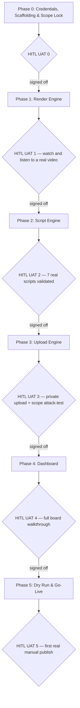

# EasyCTET YouTube Automation — Master Implementation Plan (Phased, HITL UAT Gates)

**Document Version:** 2.0 — Render Engine reprioritized to Phase 1; every phase now states its delivery artifact and closes with an explicit Human-in-the-Loop sign-off, not just a checklist.
**Target Cadence:** Daily Shorts from 15 September 2026, ramping around the 9 October 2026 CTET Paper 1 exam
**Developer Profile:** Solo developer, local Windows machine, no dedicated infra budget
**Architecture Reference:** [EasyCTET_YouTube_Automation_SSD.md](./EasyCTET_YouTube_Automation_SSD.md) (v2.0)
**Content/Voice Reference:** [EasyCTET_YouTube_Shorts_Strategy.md](./EasyCTET_YouTube_Shorts_Strategy.md)
**Script Contract:** [SCRIPT_FORMAT_SPEC.md](./SCRIPT_FORMAT_SPEC.md)
**Status:** Plan for review. Nothing below has been executed — no credentials created, no API called, nothing rendered.

> **⚠️ Revision notice (2026-09-09):** [STRATEGY_REVISION_v3.md](./STRATEGY_REVISION_v3.md) amends this plan — Phase 4 (Dashboard) is deferred, the Content Scope table below is extended by a new "5-star" curated tier, and a new listicle video type is planned outside this document's phase structure. Phases 0–3 below remain the operative build order for Render/Script/Upload Engine.

---

## Executive Summary

Three independent engines — **Render Engine** (standalone Remotion pipeline, owns its own TTS/captions/compliance), **Script Engine** (authoring), **Upload Engine** (upload + playlist only) — connected only through files on disk, tracked by one local **Dashboard**. The system's one non-negotiable property: **it cannot publish a video.** Upload Engine's OAuth scope never includes publish capability — not gated by code, absent from the permission grant itself. Publishing happens in YouTube Studio, by you, and the dashboard records it after the fact rather than causing it.

Content scope is a **374-question pedagogy-focused pool** (CDP full — 150, Maths pedagogy-only — 26, EVS pedagogy-only — 55, combined English+Hindi Language Pedagogy — 143). Voice is **100% AI** via a ranked multi-provider TTS router (Google Chirp 3 HD primary), no human recording anywhere.

**Build order is deliberately reprioritized this revision: Render Engine ships first, ahead of Script Engine.** Render Engine is the standalone, reusable, technically riskiest piece — TTS integration, Remotion rendering, Whisper captioning, the compliance guardrail. Proving it end-to-end early, against one hand-crafted script matching `SCRIPT_FORMAT_SPEC.md`, retires that risk before any time is spent on Script Engine's authoring/validation/import tooling. Script Engine formalizes *how scripts get produced at scale* — a lower-risk, more mechanical build once Render Engine has already proven it can turn a valid script into a real, watchable video.

**Every phase now ends with a named deliverable and a Human-in-the-Loop (HITL) sign-off** — a UAT checkpoint is not "the code ran without error," it's you personally watching, listening to, or reading the actual output and confirming it's right. No phase begins until the prior phase's HITL sign-off is explicitly given.

---

## Master Architecture & Directory Structure

```
easyctet-video/
├── docs -> ../docs/YT/                      # the three planning docs above
├── schemas/
│   └── video-script.v1.schema.json          # SCRIPT_FORMAT_SPEC.md, machine-readable
├── render-engine/                            # PHASE 1 — built first
│   ├── tts/
│   │   ├── router.ts                        # provider ranking + selection logic
│   │   ├── providers/                       # one thin adapter per provider (Google, Azure, Sarvam, [Gemini])
│   │   └── lexicon.json                     # SSML overrides, shared across providers
│   ├── captions/                            # Whisper timing + English-text override
│   ├── compositions/                        # Remotion: DailyDrill, ConceptCard, TrapBuster, ExamCraft, ProductMoment
│   ├── brand/                                # tokens, logo, end card — shared across compositions
│   ├── metadata/                             # title/description/tag template resolution
│   ├── guardrail/                            # compliance check — banned list, disclaimer, P5 cap
│   ├── test-scripts/                         # hand-crafted schema-conformant scripts, used before Script Engine exists
│   └── out/                                  # finished .mp4 + generated metadata, one dir per video
├── script-engine/                             # PHASE 2 — built once Render Engine is proven
│   ├── author/                              # scripts I write, grounded in docs/Question-bank/*.json
│   ├── import/                              # incoming files from an external app, pre-validation
│   └── validate.ts                          # schema validator — the gate both sources pass through
├── upload-engine/
│   ├── auth/                                 # OAuth token, scoped to upload + playlist ONLY
│   └── upload.ts                             # videos.insert (privacyStatus hardcoded private) + playlist add
├── dashboard/
│   ├── index.html                            # single local page, no public hosting
│   ├── api/                                  # local endpoints the dashboard calls (Approve/Process/Import/Status)
│   └── status_config.json                    # editable status vocabulary, not hardcoded
├── data/
│   ├── links.json                            # Play Store URL, website URL — single source, templated in everywhere
│   ├── tts_providers.json                    # per-provider safety caps + reset dates
│   ├── tts_usage_ledger.json                 # append-only — what's been sent to which provider, this month
│   └── state_ledger.json                     # per-video status across all three engines — the dashboard's source of truth
└── .env                                       # API keys, git-ignored, never committed
```

---

## Phased Roadmap with HITL UAT Gates



**Every arrow marked "signed off" requires you, specifically, to have exercised the actual output — not a green test suite.** A phase with passing automated checks but no human sign-off does not unlock the next phase.

---

## Phase 0: Credentials, Scaffolding & Scope Lock

### 📦 Phase Deliverable
A working repo skeleton, real API credentials in a git-ignored `.env`, and a runnable schema validator — nothing renders or uploads yet, but every downstream phase has what it needs to start.

### Build
1. Google Cloud project with Cloud TTS API enabled (Chirp 3 HD + Neural2).
2. YouTube Data API v3 enabled; OAuth consent screen requesting **only** `youtube.upload` and playlist-management scopes.
3. Azure Speech resource + Sarvam API key, both in `.env`.
4. Repo scaffold per the directory structure above.
5. `schemas/video-script.v1.schema.json` — machine-readable, runnable by a validator library.
6. `data/links.json` seeded with current Play Store/website URLs (placeholders acceptable pre-launch).

### 🧑‍💻 HITL UAT 0 (you personally verify)
- [ ] Run the schema validator against the worked example in `SCRIPT_FORMAT_SPEC.md` §3 — it passes.
- [ ] Run it against a deliberately broken copy — it fails, naming the specific field.
- [ ] **You** open the OAuth consent screen in Google Cloud Console and read the scope list with your own eyes — confirm no publish-capable scope appears.
- [ ] Confirm `.env` is in `.gitignore` before any key is written to it.
- [ ] **Sign-off:** ☐ I have verified the above and authorize Phase 1 to begin.

---

## Phase 1: Render Engine — Prioritized

The riskiest, most technically substantial piece, built first and proven standalone — before Script Engine's authoring tooling exists — using a hand-crafted script file placed directly in `render-engine/test-scripts/`, matching `SCRIPT_FORMAT_SPEC.md`. The worked CDP-P1-001 example already written in that spec is the natural first test input.

### 📦 Phase Deliverable
**One real, finished, watchable `.mp4`** — captioned, branded, correctly timed — produced entirely by Render Engine from a single hand-crafted script file, with zero Script Engine automation involved.

### Build
1. **TTS router** (`render-engine/tts/router.ts`): provider ranking, `tts_usage_ledger.json` tracking, safety-cap enforcement, per-provider SSML adapters reading the shared `lexicon.json`.
2. **Captions**: Whisper timing on generated audio, with the English `onScreen` text substituted in for the actual (Hinglish) transcript.
3. **Compositions**: the five Remotion templates (`DailyDrill`, `ConceptCard`, `TrapBuster`, `ExamCraft`, `ProductMoment`) per the strategy doc's brand tokens and frame timings.
4. **Metadata resolution**: script's `metadata` block + `data/links.json` → final title/description/tags.
5. **Guardrail check**: banned-vocabulary scan, disclaimer presence, P5 frequency cap — blocking.

### 🧑‍💻 HITL UAT 1 (you personally verify)
- [ ] Render the hand-crafted CDP-P1-001 script end to end: TTS (Chirp 3 HD) → captions → composition → finished `.mp4`.
- [ ] **You watch the actual video, full-screen, with sound.** Check pronunciation of "Piaget," "object permanence"; check the reveal timing; check the silence beat isn't cut off; check captions read the English text, not a mangled Hinglish transcript.
- [ ] Deliberately insert a banned phrase into a test copy of the script — confirm the guardrail check blocks it and produces nothing.
- [ ] Deliberately set a provider's safety cap artificially low in the local ledger — confirm the router fails over to the next-ranked provider rather than erroring.
- [ ] Confirm the file's duration matches the actual measured audio length, not a hardcoded frame count.
- [ ] **Sign-off:** ☐ I have watched this video myself and it is correct. Phase 2 may begin.

---

## Phase 2: Script Engine

Now built with a proven Render Engine already able to consume its output — this phase is about *producing schema-conformant scripts at scale and validating them*, not about whether a script can become a video (already proven in Phase 1).

### 📦 Phase Deliverable
**7 real Week 1 scripts, all passing formal schema validation**, plus a working Import path that a hand-crafted external file can pass through identically.

### Build
1. Validator (`script-engine/validate.ts`) wired to the Phase 0 schema.
2. Author scripts against the real 374-question scope — CDP freely, Maths/EVS pedagogy-tagged only, English+Hindi via the combined Language Pedagogy track.
3. **Retroactively validate the 7 Week 1 scripts already written** (`docs/YT/scripts/`) against the formal schema — they were written before the schema existed; confirm they conform or convert them.
4. Import path (`script-engine/import/`), same validator, `source.origin: "external-import"`.

### 🧑‍💻 HITL UAT 2 (you personally verify)
- [ ] All 7 Week 1 scripts pass the formal validator.
- [ ] A hand-crafted import file passes the same validator and lands in the queue indistinguishably from an internally-authored one.
- [ ] **You spot-check 3 scripts** against their source `questionId` in `docs/Question-bank/*.json` — `onScreen` text matches the bank verbatim.
- [ ] Confirm no Week 1 topic falls outside the narrowed 374-question scope (the EVS Day 4 substitution already caught one mismatch — check the rest by hand).
- [ ] **Take one Phase 2 script and actually run it through Phase 1's already-proven Render Engine** — confirming the two phases genuinely interoperate, not just independently pass their own tests.
- [ ] **Sign-off:** ☐ I have reviewed these scripts against the real bank myself. Phase 3 may begin.

---

## Phase 3: Upload Engine

### 📦 Phase Deliverable
**One real private video, live on the actual YouTube channel**, correctly playlisted, upload-only scope confirmed unable to publish.

### Build
1. `videos.insert` with `status.privacyStatus` hardcoded to `"private"` — no override path.
2. Playlist assignment from the script's `metadata.playlist` field.
3. Write-back to `data/state_ledger.json`: videoId, private watch URL, status → `Uploaded (Private)`.

### 🧑‍💻 HITL UAT 3 (you personally verify)
- [ ] Upload the Phase 1 test video. **You** open YouTube Studio and confirm with your own eyes it shows **Private**, not Unlisted or Public.
- [ ] Confirm it landed in the correct playlist.
- [ ] **Attempt a `videos.update` privacy-status call directly, outside Upload Engine's normal code path, using the same token** — confirm Google itself rejects it for insufficient scope. This is the real proof of the "cannot publish" property, not a source-code review.
- [ ] Confirm quota usage is within the expected ~1,600 units for one upload.
- [ ] **Sign-off:** ☐ I have confirmed the private status and the scope rejection myself. Phase 4 may begin.

---

## Phase 4: Dashboard

### 📦 Phase Deliverable
**A working local page showing the real state of every video produced so far**, with every control (Approve, Process Now, Import, Status) exercised at least once against real data, not mock data.

### Build
1. Local HTML page reading `data/state_ledger.json` across all three engines' output.
2. Controls: **Approve/Reject** (batch-capable), **▶ Process Now** (global + per-row), **Import Script**, manual **status editor**.
3. `dashboard/status_config.json` — editable status vocabulary, not hardcoded.
4. Local-only serving — no public hosting.

### 🧑‍💻 HITL UAT 4 (you personally verify)
- [ ] Load the dashboard with the real Phase 1–3 video showing its actual current state.
- [ ] Batch-approve two scripts; confirm neither triggers production by itself.
- [ ] Click **▶ Process Now**; confirm it processes only `Approved` rows.
- [ ] Click **Import Script** with a valid file and an invalid file; confirm correct accept/reject behavior.
- [ ] Manually set a row to `Published`, then `Completed`; confirm both persist with zero API calls triggered.
- [ ] Confirm the dashboard itself makes no YouTube API calls beyond what Process Now already triggered.
- [ ] **Sign-off:** ☐ I have operated every control myself against real data. Phase 5 may begin.

---

## Phase 5: Dry Run & Go-Live

### 📦 Phase Deliverable
**The first real video published on the live channel, by your own hand in YouTube Studio**, and the first full week's batch processed through the complete system.

### Build
1. One full real video — script through Approve, Process Now, private upload — reviewed exactly as a normal week would run.
2. Manual publish in YouTube Studio; status flipped to `Published`, later `Completed`, on the dashboard by hand.
3. First real week's batch (strategy doc calendar, re-checked against the §1 scope) processed and reviewed.

### 🧑‍💻 HITL UAT 5 (you personally verify)
- [ ] The dry-run video is live on the actual channel — **you check this in a browser, logged out, as a real viewer would see it.**
- [ ] Confirm the private→approved→uploaded→published sequence took exactly the steps this plan describes, no manual file edits outside the intended flow.
- [ ] Confirm `data/tts_usage_ledger.json` reflects real usage.
- [ ] **Sign-off:** ☐ First real publish confirmed live and correct, by me, in my own browser. System authorized for daily use.

---

## Content Scope (authoritative — see SSD §1)

| Subject | Rule | Count |
|---|---|---|
| CDP | Full — material and questions | 150 |
| Mathematics | Pedagogy-only | 26 |
| EVS | Pedagogy-only | 55 |
| Language Pedagogy (English + Hindi combined) | Pedagogy-only, shared track | 143 |
| **Total** | | **374** |

---

## Open Items — Not Yet Resolved, Tracked Here So They Don't Get Lost

| Item | Status |
|---|---|
| Gemini 3.1 Flash TTS token | Requested, not yet received. A/B test against Chirp 3 HD happens in Phase 1, before Gemini is added to the router's ranked list — not on documentation alone. |
| Google Neural2 vs. Chirp 3 HD — shared or separate free-tier pool? | Ambiguous in Google's own docs. Verify directly in Cloud Console billing/usage view during Phase 0. |
| `Completed` status semantics | Assumed to mean "published + post-publish tasks done," distinct from and after `Published`. Confirm before Phase 4 locks `status_config.json`. |
| Week 1 calendar vs. narrowed scope | One mismatch already caught (EVS Day 4). Remaining days checked in Phase 2's HITL UAT. |

---

## Risk Register

| Risk | Mitigation |
|---|---|
| Unattended pipeline publishes something wrong | Cannot happen — Upload Engine has no publish-capable scope, attack-tested in HITL UAT 3 |
| A TTS provider's free tier runs out mid-batch | Ranked router with local usage ledger, safety caps below documented limits, proven in HITL UAT 1 |
| Fabricated or paraphrased question content | Script Engine's non-fabrication rule, checked in HITL UAT 2 |
| Banned vocabulary or missing disclaimer reaches a real upload | Guardrail check blocks Render Engine's output entirely, checked in HITL UAT 1 |
| Render Engine built against an authoring tool that doesn't exist yet turns out unusable once Script Engine ships | Mitigated by this reprioritization itself — Phase 1 proves Render Engine against the exact schema Script Engine will later produce, so there's no integration surprise deferred to later |

---

**Nothing in this plan has been executed.** Every HITL UAT is written to require you personally exercising real output — watching a video, reading a scope list, attempting a rejected API call — never a checklist satisfied by code existing or tests passing alone.

---

*EasyCTET — Serious CTET Paper 1 prep, simplified.*
